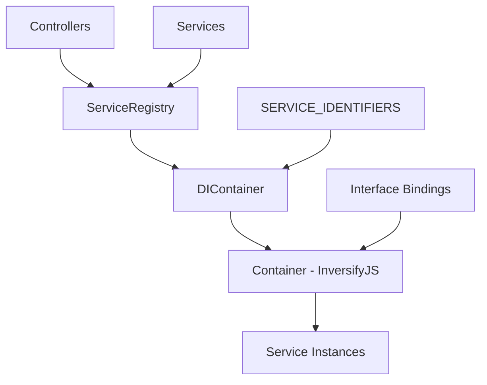

# 🔧 依赖注入容器设计

## 📋 概述

本文档描述了 ET API 项目中依赖注入 (DI) 容器的设计理念、实现方式和使用指南。DI容器是新架构的核心组件，负责管理服务实例的创建、生命周期和依赖关系。

## 🎯 设计目标

### ✅ **核心目标**
1. **松耦合** - 减少组件间的直接依赖
2. **可测试性** - 便于进行单元测试和集成测试  
3. **可配置性** - 灵活的服务配置和替换
4. **生命周期管理** - 统一的实例生命周期控制

### ✅ **技术选择**
- **容器库**: [InversifyJS](https://inversify.io/) - 成熟的TypeScript DI容器
- **装饰器**: 使用装饰器进行依赖标记
- **生命周期**: 支持单例和瞬态模式
- **接口绑定**: 基于接口的服务注册

## 🏗️ 架构设计

### 核心组件关系图



## 📁 文件结构

```
src/core.services/infrastructure/
├── DIContainer.ts              # DI容器核心实现
├── ServiceRegistry.ts          # 服务注册表 (外观模式)
├── SERVICE_IDENTIFIERS.ts      # 服务标识符常量
└── interfaces/
    ├── IRepository.ts          # 仓储接口
    ├── IDomainService.ts       # 领域服务接口
    └── IApplicationService.ts  # 应用服务接口
```

## 🔧 核心实现

### 1. 服务标识符 (SERVICE_IDENTIFIERS)

```typescript
// infrastructure/SERVICE_IDENTIFIERS.ts
export const SERVICE_IDENTIFIERS = {
    // Repository Layer
    TagRepository: Symbol.for('TagRepository'),
    RecipientRepository: Symbol.for('RecipientRepository'),
    ActivityCategoryRepository: Symbol.for('ActivityCategoryRepository'),
    
    // Domain Layer  
    TagDomainService: Symbol.for('TagDomainService'),
    RecipientDomainService: Symbol.for('RecipientDomainService'),
    
    // Application Layer
    TagApplicationService: Symbol.for('TagApplicationService'),
    RecipientApplicationService: Symbol.for('RecipientApplicationService'),
    
    // Models (for injection into repositories/services)
    TagModel: Symbol.for('TagModel'),
    NoteModel: Symbol.for('NoteModel'),
    ActivityLogModel: Symbol.for('ActivityLogModel'),
} as const;
```

### 2. DI容器 (DIContainer)

```typescript
// infrastructure/DIContainer.ts
import { Container } from 'inversify';
import { TagModel } from '../../core.models/db/TagModel';
import { NoteModel } from '../../core.models/db/NoteModel';
import { ActivityLogModel } from '../../core.models/db/ActivityLogModel';

export class DIContainer {
    private container: Container;
    private static instance: DIContainer;

    private constructor() {
        this.container = new Container();
        this.setupBindings();
    }

    public static getInstance(): DIContainer {
        if (!DIContainer.instance) {
            DIContainer.instance = new DIContainer();
        }
        return DIContainer.instance;
    }

    private setupBindings(): void {
        this.setupModelBindings();
        this.setupTagBindings();
        // 其他实体的绑定...
    }

    private setupModelBindings(): void {
        // Mongoose Model 绑定
        this.container.bind<typeof TagModel>(SERVICE_IDENTIFIERS.TagModel)
            .toConstantValue(TagModel);
        this.container.bind<typeof NoteModel>(SERVICE_IDENTIFIERS.NoteModel)
            .toConstantValue(NoteModel);
        this.container.bind<typeof ActivityLogModel>(SERVICE_IDENTIFIERS.ActivityLogModel)
            .toConstantValue(ActivityLogModel);
    }

    private setupTagBindings(): void {
        // Repository Layer
        this.container.bind<ITagRepository>(SERVICE_IDENTIFIERS.TagRepository)
            .to(TagRepository).inSingletonScope();

        // Domain Layer
        this.container.bind<ITagDomainService>(SERVICE_IDENTIFIERS.TagDomainService)
            .to(TagDomainService).inSingletonScope();

        // Application Layer  
        this.container.bind<ITagApplicationService>(SERVICE_IDENTIFIERS.TagApplicationService)
            .to(TagApplicationService).inSingletonScope();
    }

    public getContainer(): Container {
        return this.container;
    }

    // 类型安全的服务获取方法
    public get<T>(identifier: symbol): T {
        return this.container.get<T>(identifier);
    }

    // 重新绑定服务 (用于测试)
    public rebind<T>(identifier: symbol, implementation: any): void {
        this.container.rebind<T>(identifier).to(implementation);
    }
}
```

### 3. 服务注册表 (ServiceRegistry)

```typescript
// infrastructure/ServiceRegistry.ts
export class ServiceRegistry {
    private diContainer: DIContainer;
    private static instance: ServiceRegistry;

    private constructor() {
        this.diContainer = DIContainer.getInstance();
    }

    public static getInstance(): ServiceRegistry {
        if (!ServiceRegistry.instance) {
            ServiceRegistry.instance = new ServiceRegistry();
        }
        return ServiceRegistry.instance;
    }

    // Tag 相关服务
    public getTagRepository(): ITagRepository {
        return this.diContainer.get<ITagRepository>(SERVICE_IDENTIFIERS.TagRepository);
    }

    public getTagDomainService(): ITagDomainService {
        return this.diContainer.get<ITagDomainService>(SERVICE_IDENTIFIERS.TagDomainService);
    }

    public getTagApplicationService(): ITagApplicationService {
        return this.diContainer.get<ITagApplicationService>(SERVICE_IDENTIFIERS.TagApplicationService);
    }

    // 获取DI容器 (用于高级用法)
    public getContainer(): Container {
        return this.diContainer.getContainer();
    }
}
```

## 💡 使用指南

### 1. 在服务中使用DI

```typescript
// repositories/TagRepository.ts
import { injectable, inject } from 'inversify';

@injectable()
export class TagRepository extends BaseRepository<ITagDocument> implements ITagRepository {
    constructor(
        @inject(SERVICE_IDENTIFIERS.TagModel) tagModel: Model<ITagDocument>
    ) {
        super(tagModel);
    }

    async findByName(authUser: AuthUser, name: string): Promise<ITagDocument | null> {
        return this.findOne({ 
            dataGroup: authUser.dataGroup, 
            name: { $regex: new RegExp(`^${name}$`, 'i') }
        });
    }
}
```

```typescript
// domain/tag/TagDomainService.ts
import { injectable, inject } from 'inversify';

@injectable()
export class TagDomainService implements ITagDomainService {
    constructor(
        @inject(SERVICE_IDENTIFIERS.TagRepository) 
        private tagRepository: ITagRepository,
        
        @inject(SERVICE_IDENTIFIERS.NoteModel) 
        private noteModel: Model<INoteDocument>,
        
        @inject(SERVICE_IDENTIFIERS.ActivityLogModel) 
        private activityLogModel: Model<IActivityLogDocument>
    ) {}

    async validateTagCreation(authUser: AuthUser, createTagDto: CreateTagDto): Promise<void> {
        const existingTag = await this.tagRepository.findByName(authUser, createTagDto.name);
        if (existingTag) {
            throw new BusinessError('ALREADY_EXISTS', 'Tag name already exists', { existingTag });
        }
    }
}
```

### 2. 在Service Layer中使用

```typescript
// TagService.ts
export class TagService {
    private tagApplicationService: ITagApplicationService;
    
    constructor() {
        // 通过ServiceRegistry获取服务
        const serviceRegistry = ServiceRegistry.getInstance();
        this.tagApplicationService = serviceRegistry.getTagApplicationService();
    }

    async createTag(authUser: AuthUser, data: Partial<ITag>): Promise<ITagDocument> {
        const createTagDto: CreateTagDto = {
            name: data.name || '',
            isNoteTag: data.isNoteTag,
            // ... DTO 转换
        };
        
        return this.tagApplicationService.createTag(authUser, createTagDto);
    }
}
```

### 3. 在测试中使用DI

```typescript
// tests/tagService.test.ts
describe('TagService', () => {
    let tagService: TagService;
    let mockTagRepository: jest.Mocked<ITagRepository>;
    let diContainer: DIContainer;

    beforeEach(async () => {
        // 创建mock服务
        mockTagRepository = {
            findByName: jest.fn(),
            create: jest.fn(),
            findById: jest.fn(),
            // ... 其他方法
        } as jest.Mocked<ITagRepository>;

        // 获取DI容器并重新绑定mock服务
        diContainer = DIContainer.getInstance();
        diContainer.rebind<ITagRepository>(
            SERVICE_IDENTIFIERS.TagRepository, 
            () => mockTagRepository
        );

        tagService = new TagService();
    });

    test('应该能够创建标签', async () => {
        // 设置mock行为
        mockTagRepository.findByName.mockResolvedValue(null);
        mockTagRepository.create.mockResolvedValue(mockTag);

        // 执行测试
        const result = await tagService.createTag(mockAuthUser, mockTagData);

        // 验证结果
        expect(result).toEqual(mockTag);
        expect(mockTagRepository.findByName).toHaveBeenCalledWith(
            mockAuthUser, 
            mockTagData.name
        );
    });
});
```

## 🎯 最佳实践

### ✅ **推荐做法**

1. **使用接口进行绑定**
   ```typescript
   // ✅ 推荐：绑定到接口
   container.bind<ITagRepository>(SERVICE_IDENTIFIERS.TagRepository)
       .to(TagRepository);
   
   // ❌ 避免：直接绑定具体类
   container.bind<TagRepository>('TagRepository').to(TagRepository);
   ```

2. **合理选择生命周期**
   ```typescript
   // ✅ Repository和Service使用单例
   .to(TagRepository).inSingletonScope();
   
   // ✅ 一次性对象使用瞬态
   .to(TemporaryProcessor).inTransientScope();
   ```

3. **明确的服务标识符**
   ```typescript
   // ✅ 使用Symbol和描述性名称
   TagRepository: Symbol.for('TagRepository'),
   
   // ❌ 避免字符串标识符
   'tagRepo'
   ```

### ❌ **避免的做法**

1. **循环依赖**
   ```typescript
   // ❌ 避免：A依赖B，B又依赖A
   // 通过重新设计接口或引入第三方服务解决
   ```

2. **过度依赖**
   ```typescript
   // ❌ 避免：一个服务依赖太多其他服务
   constructor(
       dep1, dep2, dep3, dep4, dep5, dep6, dep7, dep8 // 太多依赖
   ) {}
   
   // ✅ 推荐：重新设计服务边界
   ```

3. **在constructor中进行业务逻辑**
   ```typescript
   // ❌ 避免：在构造函数中执行异步操作或复杂逻辑
   constructor() {
       this.loadData(); // 异步操作
   }
   
   // ✅ 推荐：在专门的初始化方法中
   async initialize() {
       await this.loadData();
   }
   ```

## 🔧 调试和故障排除

### 常见问题及解决方案

#### 1. 服务未注册错误
```
Error: No matching bindings found for serviceIdentifier: Symbol(TagRepository)
```

**解决方案**:
```typescript
// 检查是否在 DIContainer 中注册了服务
private setupTagBindings(): void {
    this.container.bind<ITagRepository>(SERVICE_IDENTIFIERS.TagRepository)
        .to(TagRepository).inSingletonScope(); // 确保这行存在
}
```

#### 2. 循环依赖错误
```
Error: Circular dependency detected
```

**解决方案**:
```typescript
// 重新设计服务边界，避免相互依赖
// 或使用 @multiInject 和事件模式
```

#### 3. 类型不匹配错误
```
TypeError: Cannot read property 'method' of undefined
```

**解决方案**:
```typescript
// 确保接口和实现匹配
// 检查@injectable装饰器是否存在
@injectable()
export class TagRepository { } // 必须有这个装饰器
```

### 调试工具

```typescript
// 在开发环境中打印容器信息
if (process.env.NODE_ENV === 'development') {
    console.log('DI Container bindings:', container.getAll());
}

// 检查特定服务是否已注册
try {
    const service = container.get(SERVICE_IDENTIFIERS.TagRepository);
    console.log('TagRepository is registered:', !!service);
} catch (error) {
    console.log('TagRepository is not registered');
}
```

## 🚀 性能考虑

### 优化建议

1. **合理使用单例模式**
   ```typescript
   // Repository和DomainService适合单例
   .inSingletonScope()
   
   // 避免状态的服务使用瞬态
   .inTransientScope()
   ```

2. **延迟加载重要服务**
   ```typescript
   // 使用工厂模式延迟创建昂贵的服务
   container.bind<IExpensiveService>('ExpensiveService')
       .toFactory<IExpensiveService>(() => {
           return () => new ExpensiveService();
       });
   ```

3. **监控容器性能**
   ```typescript
   // 记录服务创建时间
   const start = Date.now();
   const service = container.get(identifier);
   console.log(`Service creation took: ${Date.now() - start}ms`);
   ```

---

**最后更新**: 2024年
**架构版本**: v1.0 