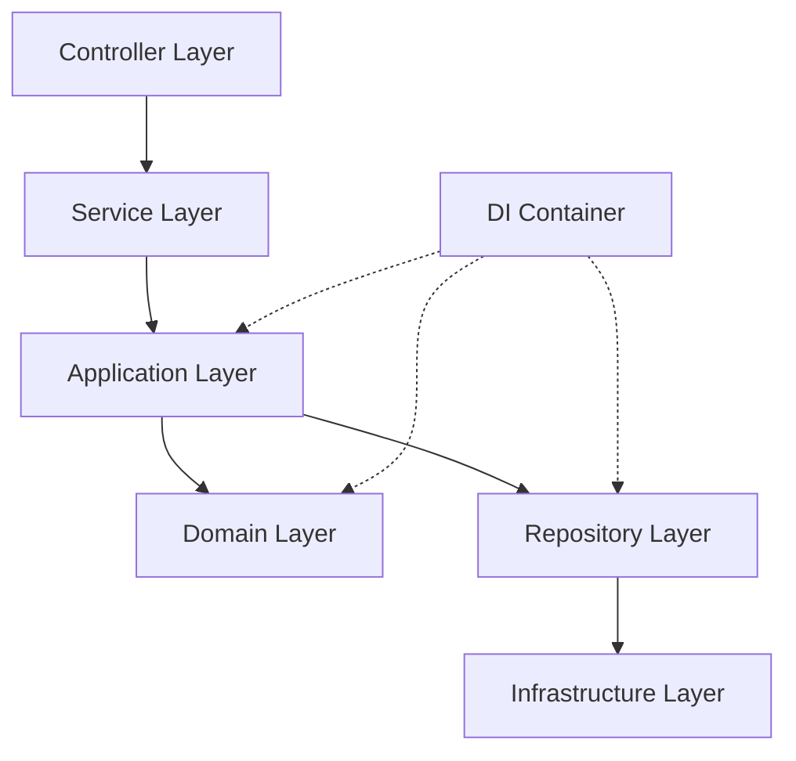

# 🏗️ 新分层架构设计

## 📋 概述

本文档描述了 ET API 项目重构后的现代分层架构。新架构采用了**领域驱动设计 (DDD)** 和**依赖注入 (DI)** 模式，提供了清晰的关注点分离和更好的可维护性。

## 🏛️ 架构层次



## 📚 各层详细说明

### 1. 🌐 Controller Layer (控制器层)
**位置**: `src/core.controllers/`
**职责**: 处理 HTTP 请求和响应

```typescript
// 示例: tagController.ts
export const createTag: RequestHandler = async (req, res, next) => {
    try {
        const tagService = ServiceFactory.getTagService();
        const tag = await tagService.createTag(getAuthUser(req), req.body);
        res.status(200).json(tag);
    } catch (error) {
        next(error);
    }
};
```

**特点**:
- 处理 HTTP 请求验证
- 调用 Service Layer
- 处理错误响应
- 不包含业务逻辑

### 2. ⚙️ Service Layer (服务层)
**位置**: `src/core.services/[Entity]Service.ts`
**职责**: 提供统一的业务接口和向后兼容性

```typescript
// 示例: TagService.ts
export class TagService {
    private tagApplicationService: ITagApplicationService;
    
    constructor() {
        const serviceRegistry = ServiceRegistry.getInstance();
        this.tagApplicationService = serviceRegistry.getTagApplicationService();
    }

    async createTag(authUser: AuthUser, data: Partial<ITag>): Promise<ITagDocument> {
        const createTagDto: CreateTagDto = {
            name: data.name || '',
            isNoteTag: data.isNoteTag,
            // ... DTO 转换
        };
        
        return this.tagApplicationService.createTag(authUser, createTagDto);
    }
}
```

**特点**:
- DTO 转换和数据适配
- 向后兼容旧接口
- 统一的 Population 配置
- 委托给 Application Layer

### 3. 🎯 Application Layer (应用层)
**位置**: `src/core.services/application/[Entity]ApplicationService.ts`
**职责**: 协调多个服务和复杂的业务流程

```typescript
// 示例: TagApplicationService.ts
export class TagApplicationService implements ITagApplicationService {
    constructor(
        private tagRepository: ITagRepository,
        private tagDomainService: ITagDomainService
    ) {}

    async createTag(authUser: AuthUser, createTagDto: CreateTagDto): Promise<ITagDocument> {
        // 1. 业务验证
        await this.tagDomainService.validateTagCreation(authUser, createTagDto);
        
        // 2. 创建实体
        const tag = await this.tagRepository.create({
            ...createTagDto,
            dataGroup: authUser.dataGroup
        });
        
        // 3. 返回结果 (可选择性填充)
        return this.tagRepository.findById(tag._id.toString(), { populate: population });
    }

    async deleteTag(authUser: AuthUser, id: string): Promise<boolean> {
        // 复杂的删除流程：检查依赖 + 清理相关数据
        const canDelete = await this.tagDomainService.canDeleteTag(authUser, id);
        if (!canDelete) {
            throw new Error('Cannot delete tag due to dependencies');
        }
        
        // 清理相关数据
        await this.tagDomainService.cleanupTagReferences(authUser, id);
        
        // 删除标签
        return this.tagRepository.deleteById(id);
    }
}
```

**特点**:
- 协调 Repository 和 Domain Service
- 处理复杂的业务流程
- 事务管理和错误处理
- 跨领域的业务逻辑

### 4. 🧠 Domain Layer (领域层)
**位置**: `src/core.services/domain/[entity]/[Entity]DomainService.ts`
**职责**: 核心业务逻辑和验证

```typescript
// 示例: TagDomainService.ts
export class TagDomainService implements ITagDomainService {
    constructor(
        private tagRepository: ITagRepository,
        private noteModel: Model<INoteDocument>,
        private activityLogModel: Model<IActivityLogDocument>
    ) {}

    async validateTagCreation(authUser: AuthUser, createTagDto: CreateTagDto): Promise<void> {
        // 检查标签名称是否已存在
        const existingTag = await this.tagRepository.findByName(authUser, createTagDto.name);
        if (existingTag) {
            throw new BusinessError('ALREADY_EXISTS', 'Tag name already exists', { existingTag });
        }

        // 业务规则验证
        if (createTagDto.isSubActivity && !createTagDto.activityCategories?.length) {
            throw new BusinessError('VALIDATION_ERROR', 'SubActivity tags must have activity categories');
        }
    }

    async canDeleteTag(authUser: AuthUser, tagId: string): Promise<boolean> {
        // 检查是否有笔记使用此标签
        const noteCount = await this.noteModel.countDocuments({
            dataGroup: authUser.dataGroup,
            noteTags: tagId
        });

        return noteCount === 0;
    }

    async cleanupTagReferences(authUser: AuthUser, tagId: string): Promise<void> {
        // 清理活动日志中的标签引用
        await this.activityLogModel.updateMany(
            { dataGroup: authUser.dataGroup },
            { $pull: { 'executedActivities.$[].activityTags': { tag: tagId } } }
        );
    }
}
```

**特点**:
- 纯业务逻辑，不依赖基础设施
- 业务规则验证
- 领域实体行为
- 业务异常处理

### 5. 🗄️ Repository Layer (仓储层)
**位置**: `src/core.services/repositories/[Entity]Repository.ts`
**职责**: 数据访问抽象

```typescript
// 示例: TagRepository.ts
export class TagRepository extends BaseRepository<ITagDocument> implements ITagRepository {
    constructor(tagModel: Model<ITagDocument>) {
        super(tagModel);
    }

    async findByDataGroup(dataGroup: string, options?: QueryOptions): Promise<ITagDocument[]> {
        return this.findMany({ dataGroup }, options);
    }

    async findByName(authUser: AuthUser, name: string): Promise<ITagDocument | null> {
        return this.findOne({ 
            dataGroup: authUser.dataGroup, 
            name: { $regex: new RegExp(`^${name}$`, 'i') }
        });
    }

    async findByLike(authUser: AuthUser, query: string, options?: QueryOptions): Promise<ITagDocument[]> {
        return this.findMany({
            dataGroup: authUser.dataGroup,
            name: { $regex: query, $options: 'i' }
        }, options);
    }
}
```

**特点**:
- 继承自 BaseRepository
- 数据访问的统一接口
- 查询优化和缓存
- 数据权限过滤

### 6. 🔧 Infrastructure Layer (基础设施层)
**位置**: `src/core.services/infrastructure/`
**职责**: 依赖注入、配置和工具

```typescript
// DI Container
export class DIContainer {
    private container = new Container();

    constructor() {
        this.setupBindings();
    }

    private setupBindings(): void {
        // Repository bindings
        this.container.bind<ITagRepository>(SERVICE_IDENTIFIERS.TagRepository)
            .to(TagRepository).inSingletonScope();

        // Domain service bindings  
        this.container.bind<ITagDomainService>(SERVICE_IDENTIFIERS.TagDomainService)
            .to(TagDomainService).inSingletonScope();

        // Application service bindings
        this.container.bind<ITagApplicationService>(SERVICE_IDENTIFIERS.TagApplicationService)
            .to(TagApplicationService).inSingletonScope();
    }
}
```

**特点**:
- 依赖注入配置
- 服务生命周期管理
- 横切关注点 (日志、缓存等)
- 第三方服务集成

## 🔄 数据流示例

### 创建标签的完整流程:

```
1. Controller 接收 HTTP 请求
   ↓
2. Service Layer 进行 DTO 转换
   ↓
3. Application Layer 协调业务流程
   ↓
4. Domain Layer 执行业务验证
   ↓
5. Repository Layer 执行数据持久化
   ↓
6. 结果原路返回
```

## 🎯 架构优势

### ✅ **关注点分离**
- 每层都有明确的职责
- 降低代码复杂度
- 提高可维护性

### ✅ **可测试性**
- 依赖注入便于单元测试
- 每层可独立测试
- Mock 和 Stub 易于实现

### ✅ **可扩展性**
- 新功能易于添加
- 现有功能易于修改
- 支持插件式扩展

### ✅ **向后兼容**
- 保持现有 API 接口
- 渐进式重构
- 降低迁移风险

## 📁 目录结构

```
src/core.services/
├── infrastructure/           # 基础设施层
│   ├── DIContainer.ts       # 依赖注入容器
│   ├── ServiceRegistry.ts   # 服务注册表
│   └── interfaces/          # 基础设施接口
├── repositories/            # 仓储层
│   ├── BaseRepository.ts    # 基础仓储
│   ├── TagRepository.ts     # 标签仓储
│   └── interfaces/          # 仓储接口
├── domain/                  # 领域层
│   └── tag/                 # 标签领域
│       ├── TagDomainService.ts
│       └── interfaces/
├── application/             # 应用层
│   └── TagApplicationService.ts
└── TagService.ts           # 服务层 (向后兼容)
```

## 🚀 未来计划

1. **继续重构其他服务**
   - RecipientService (小型)
   - ActivityCategoryService (中型)  
   - StatisticsService (大型)

2. **完善基础设施**
   - 添加缓存层
   - 统一日志记录
   - 性能监控

3. **增强功能**
   - 事务支持
   - 事件驱动架构
   - 微服务准备

---

**最后更新**: 2024年
**重构状态**: TagService ✅ 完成 