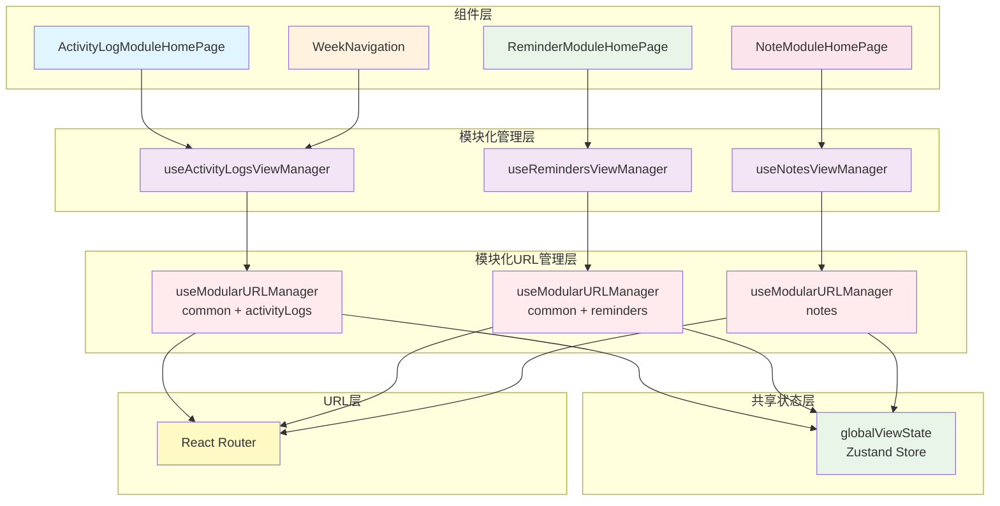

# 模块化URL和视图状态管理架构

## 问题分析

之前的全局管理架构存在一个重要问题：**URL参数污染**

### 问题示例
```
# 活动日志页面却包含了提醒模块的参数
/activity-logs?date=2024-01-15&tab=sequence&remindersCategory=work&viewMode=full

# 提醒页面却包含了活动日志的参数
/reminders?date=2024-01-15&remindersCategory=work&viewMode=full&tab=sequence

# 最严重的问题：首次访问提醒模块时出现笔记模块的参数
/tasks → /tasks?view=quick-notes&category=work&date=2024-01-15&remindersCategory=all&viewMode=full
```

这导致：
1. URL变得冗长且混乱
2. 不相关的参数会出现在URL中
3. 难以维护和理解
4. 可能导致意外的状态变化
5. **首次访问时参数补全错误**

### 根本原因分析

经过深入分析，发现问题的根本原因在于 **`useModularURLManager` 的初始化逻辑**：

#### 问题场景
1. 用户从笔记页面 `/notes?view=quick-notes&category=work` 导航到提醒页面 `/tasks`
2. 浏览器的 `searchParams` 仍然包含笔记模块的参数：`view=quick-notes&category=work`
3. `useModularURLManager` 执行初始化时，会基于当前的 `searchParams` 创建新的 `URLSearchParams`
4. 这导致笔记模块的参数被意外保留

#### 错误的初始化逻辑
```typescript
// 错误的逻辑：会保留所有现有参数
const newParams = new URLSearchParams(searchParams); // 包含了 view=quick-notes&category=work
newParams.set('date', todayString); // 只是添加日期参数
setSearchParams(newParams, { replace: true }); // 结果：view=quick-notes&category=work&date=2024-01-15
```

#### 修复后的初始化逻辑
```typescript
// 正确的逻辑：只保留相关模块的参数
const newParams = new URLSearchParams(); // 创建全新的URLSearchParams
newParams.set('date', todayString); // 设置日期参数

// 只保留当前模块的其他现有参数
relevantParams.forEach(param => {
    if (param !== 'date') {
        const value = searchParams.get(param);
        if (value) {
            newParams.set(param, value);
        }
    }
});

setSearchParams(newParams, { replace: true }); // 结果：date=2024-01-15
```

### 执行时序问题

还有一个重要的执行时序问题：

1. **`useModularURLManager` 先执行**：负责基础参数（如日期）的初始化
2. **`useRemindersViewManager` 后执行**：负责模块特定参数的补全和清理

如果 `useModularURLManager` 在第一步就污染了URL，那么后续的清理就变得复杂。

### 偏好数据缺失问题

当用户偏好被删除时，会出现以下问题：

1. **依赖数组问题**：`useRemindersViewManager` 的 `useEffect` 依赖于 `reminderPageState?.remindersCategory`
2. **重复初始化**：当偏好数据从 `undefined` 变为有值时，会触发重复初始化
3. **初始化阻塞**：如果 `isInitialized` 已经为 `true`，则不会重新初始化

#### 修复方案
```typescript
// 移除偏好数据的依赖，避免重复初始化
}, [urlManager, isInitialized]); // 移除 reminderPageState 依赖
```

## 解决方案：模块化架构

### 核心思想
每个模块只管理自己需要的URL参数，避免参数污染。

### 架构设计

#### 1. 模块化URL管理器 (`useModularURLManager`)
```typescript
// 支持的模块类型
export type ModuleType = 'common' | 'activityLogs' | 'reminders' | 'notes';

// 每个模块只管理相关参数
const useModularURLManager = (modules: ModuleType[]) => {
    // 根据模块类型确定需要管理的参数
    const relevantParams = useMemo(() => {
        const params: string[] = [];
        
        if (modules.includes('common')) {
            params.push('date', 'timezone');
        }
        
        if (modules.includes('activityLogs')) {
            params.push('tab');
        }
        
        if (modules.includes('reminders')) {
            params.push('remindersCategory', 'viewMode');
        }
        
        if (modules.includes('notes')) {
            params.push('view', 'category', 'flagged', 'completed', 'mode', 'q', 'activityCategory', 'project', 'tags');
        }
        
        return params;
    }, [modules]);
    
    // 只更新相关参数
    // ...
};
```

#### 2. 专用的视图管理器
```typescript
// 活动日志专用管理器
export const useActivityLogsViewManager = () => {
    const urlManager = useModularURLManager(['common', 'activityLogs']);
    // 只处理活动日志相关的状态
};

// 提醒专用管理器
export const useRemindersViewManager = () => {
    const urlManager = useModularURLManager(['common', 'reminders']);
    // 只处理提醒相关的状态
};

// 笔记专用管理器
export const useNotesViewManager = () => {
    const urlManager = useModularURLManager(['notes']);
    // 只处理笔记相关的状态
};
```

### 使用方式对比

#### 之前的全局架构
```tsx
// 所有组件都使用同一个管理器
const globalViewManager = useGlobalViewManager(); // 已删除

// 问题：URL包含所有模块的参数
// /activity-logs?date=2024-01-15&tab=sequence&remindersCategory=work&viewMode=full
```

#### 新的模块化架构
```tsx
// 活动日志组件
const ActivityLogModuleHomePage = () => {
    const activityLogsViewManager = useActivityLogsViewManager();
    // URL只包含相关参数: /activity-logs?date=2024-01-15&tab=sequence
};

// 提醒组件
const ReminderModuleHomePage = () => {
    const remindersViewManager = useRemindersViewManager();
    // URL只包含相关参数: /reminders?date=2024-01-15&remindersCategory=work&viewMode=full
};

// 笔记组件
const NoteModuleHomePage = () => {
    const notesViewManager = useNotesViewManager();
    // URL只包含相关参数: /notes?view=todo-notes&category=work&flagged=true
};
```

## 架构图

### 模块化架构图


### URL参数分离图
```mermaid
graph LR
    subgraph "活动日志模块"
        A1[common: date, timezone]
        A2[activityLogs: tab]
    end
    
    subgraph "提醒模块"
        B1[common: date, timezone]
        B2[reminders: category, viewMode]
    end
    
    subgraph "实际URL"
        C1[/activity-logs?date=2024-01-15&tab=sequence]
        C2[/reminders?date=2024-01-15&remindersCategory=work&viewMode=full]
    end
    
    A1 --> C1
    A2 --> C1
    B1 --> C2
    B2 --> C2
    
    style A1 fill:#e1f5fe
    style A2 fill:#e1f5fe
    style B1 fill:#e8f5e8
    style B2 fill:#e8f5e8
    style C1 fill:#fff3e0
    style C2 fill:#fff3e0
```

## 优势对比

### 之前的全局架构
❌ **缺点**：
- URL包含不相关的参数
- 难以维护和理解
- 参数污染问题
- 模块间耦合度高

✅ **优点**：
- 统一的状态管理
- 简单的API

### 新的模块化架构
✅ **优点**：
- 每个模块只管理相关参数
- URL干净整洁
- 模块间解耦
- 易于扩展和维护
- 保持了统一的状态管理

❌ **缺点**：
- 稍微增加了代码复杂度
- 需要为每个模块创建专用管理器

## 实际效果

### URL对比
```bash
# 之前：参数污染
/activity-logs?date=2024-01-15&tab=sequence&remindersCategory=work&viewMode=full

# 现在：参数清洁
/activity-logs?date=2024-01-15&tab=sequence

# 之前：参数污染
/reminders?date=2024-01-15&tab=sequence&remindersCategory=work&viewMode=full

# 现在：参数清洁
/reminders?date=2024-01-15&remindersCategory=work&viewMode=full
```

### 代码对比
```tsx
// 之前：所有组件使用同一个管理器
const globalViewManager = useGlobalViewManager(); // 已删除

// 现在：每个模块使用专用管理器
const activityLogsViewManager = useActivityLogsViewManager();
const remindersViewManager = useRemindersViewManager();
```

## 使用指南

### 1. 活动日志模块
```tsx
import { useActivityLogsViewManager } from '@/utils/hooks/useModularViewManager';

const ActivityLogModuleHomePage = () => {
    const {
        selectedDate,
        viewMode,
        isToday,
        isInitialized,
        updateDate,
        updateViewMode
    } = useActivityLogsViewManager();
    
    // 只管理活动日志相关的状态
};
```

### 2. 提醒模块
```tsx
import { useRemindersViewManager } from '@/utils/hooks/useModularViewManager';

const ReminderModuleHomePage = () => {
    const {
        selectedDate,
        reminderCategory,
        reminderViewMode,
        updateReminderCategory,
        updateReminderViewMode
    } = useRemindersViewManager();
    
    // 只管理提醒相关的状态
};
```

### 3. 共享组件（如WeekNavigation）
```tsx
import { useActivityLogsViewManager } from '@/utils/hooks/useModularViewManager';

const WeekNavigation = ({ selectedDate: propSelectedDate, onDateChange: propOnDateChange }) => {
    const activityLogsViewManager = useActivityLogsViewManager();
    
    // 优先使用全局状态，保持向后兼容
    const selectedDate = propSelectedDate || activityLogsViewManager.selectedDate;
    const onDateChange = propOnDateChange || activityLogsViewManager.updateDate;
};
```

## 扩展指南

### 添加新模块
1. 在 `ModuleType` 中添加新的模块类型
2. 在 `useModularURLManager` 中添加新模块的参数映射
3. 创建新模块的专用视图管理器
4. 在 `globalViewState` 中添加新模块的状态（如果需要）

```typescript
// 1. 添加模块类型
export type ModuleType = 'common' | 'activityLogs' | 'reminders' | 'newModule';

// 2. 添加参数映射
if (modules.includes('newModule')) {
    params.push('newParam1', 'newParam2');
}

// 3. 创建专用管理器
export const useNewModuleViewManager = () => {
    const urlManager = useModularURLManager(['common', 'newModule']);
    // 新模块的逻辑
};
```

## 迁移指南

### 从全局架构迁移到模块化架构
1. 识别组件属于哪个模块
2. 替换 `useGlobalViewManager`（已删除）为对应的模块化管理器
3. 更新组件中的状态访问方式
4. 测试URL参数是否正确

### 迁移检查清单
- [ ] 确认URL只包含相关参数
- [ ] 确认状态管理功能正常
- [ ] 确认初始化逻辑正确
- [ ] 确认向后兼容性（如果需要）

## 总结

模块化架构解决了URL参数污染的问题，让每个模块只管理自己需要的参数，提高了代码的可维护性和URL的可读性。同时保持了统一的状态管理和清晰的数据流。 