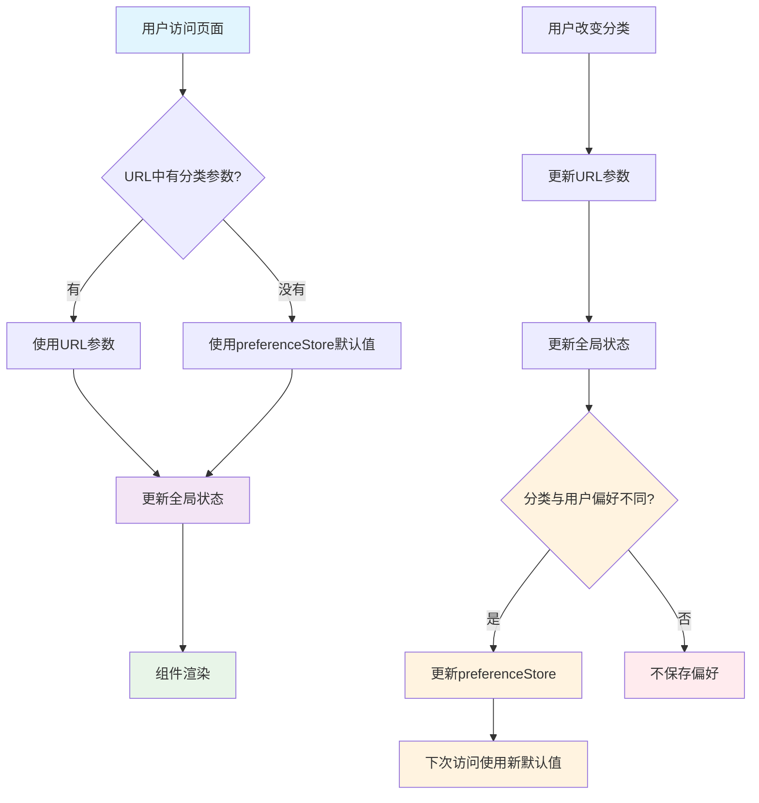

# PreferenceStore 与模块化架构整合方案

## 问题分析

在实现模块化URL管理架构时，发现与现有的 `preferenceStore.ts` 存在功能重叠：

### 重叠的状态管理
1. **preferenceStore**: `taskManagementHomePage.remindersCategory` (持久化用户偏好)
2. **模块化架构**: `reminderCategory` (URL驱动的实时状态)

这可能导致：
- 状态不一致
- 用户偏好被忽略
- 重复的状态管理逻辑
- **不必要的偏好保存** - 每次访问都保存偏好

## 解决方案：协同工作

### 设计原则
让两个系统协同工作，而不是替代：

1. **preferenceStore** - 作为默认值和持久化存储
2. **模块化架构** - 作为实时状态和URL同步
3. **智能保存** - 只在真正需要时保存用户偏好

### 数据流设计



## 整合实现

### 1. 智能的状态读取逻辑

```typescript
// 监听URL中的分类参数变化，如果没有URL参数则使用用户偏好
useEffect(() => {
    if (!isInitialized) return;
    
    const urlCategory = urlManager.params.remindersCategory;
    
    if (urlCategory) {
        // URL中有分类参数，使用URL参数
        if (urlCategory !== viewState.reminderCategory) {
            viewState.setReminderCategory(urlCategory);
        }
    } else {
        // URL中没有分类参数，使用用户偏好作为默认值
        if (defaultCategory !== viewState.reminderCategory) {
            viewState.setReminderCategory(defaultCategory);
        }
    }
}, [urlManager.params.remindersCategory, viewState.reminderCategory, defaultCategory, isInitialized]);
```

### 2. 智能的偏好保存逻辑

```typescript
// 更新提醒分类 - 智能保存用户偏好
const updateReminderCategory = useCallback((category: string) => {
    // 更新URL
    urlManager.updateURL({ remindersCategory: category });
    
    // 只在分类与当前用户偏好不同时才更新用户偏好
    if (category !== defaultCategory) {
        updatePageViewState('taskManagementHomePage', {
            remindersCategory: category
        });
    }
}, [urlManager, updatePageViewState, defaultCategory]);
```

### 3. 状态优先级

1. **URL参数** (最高优先级) - 当前会话的实时状态
2. **用户偏好** (中等优先级) - 用户的个人默认设置
3. **系统默认** (最低优先级) - 应用的出厂设置

### 4. 偏好保存策略

```typescript
// 读取优先级: URL > 用户偏好 > 系统默认
const getCurrentCategory = () => {
    return urlManager.params.remindersCategory || // URL参数
           reminderPageState?.remindersCategory || // 用户偏好
           'all'; // 系统默认
};

// 写入策略: 智能保存偏好
const updateCategory = (category: string) => {
    urlManager.updateURL({ remindersCategory: category }); // 实时状态
    
    // 只在与用户偏好不同时才保存
    if (category !== currentUserPreference) {
        updatePageViewState('taskManagementHomePage', { remindersCategory: category });
    }
};
```

## 使用场景

### 场景1: 用户首次访问（偏好为'work'）
```
URL: /reminders (没有分类参数)

1. 检查URL参数: 无
2. 使用用户偏好: 'work'
3. 设置全局状态: reminderCategory = 'work'
4. 不保存偏好 (因为已经是用户偏好)
5. 不更新URL (保持URL干净)
```

### 场景2: 用户通过URL访问
```
URL: /reminders?remindersCategory=life
用户偏好: 'work'

1. URL参数优先: 使用 'life'
2. 设置全局状态: reminderCategory = 'life'
3. 不保存偏好 (用户可能只是临时查看)
4. 显示生活分类的提醒
```

### 场景3: 用户切换分类（从'work'切换到'study'）
```
当前偏好: 'work'
用户操作: 点击切换到 'study'

1. 更新URL: /reminders?remindersCategory=study
2. 更新全局状态: reminderCategory = 'study'
3. 检查: 'study' !== 'work' (用户偏好)
4. 保存新偏好: taskManagementHomePage.remindersCategory = 'study'
5. 下次访问时 'study' 成为默认值
```

### 场景4: 用户切换回偏好分类
```
当前偏好: 'work'
当前URL: /reminders?remindersCategory=life
用户操作: 点击切换回 'work'

1. 更新URL: /reminders?remindersCategory=work
2. 更新全局状态: reminderCategory = 'work'
3. 检查: 'work' === 'work' (用户偏好)
4. 不保存偏好 (避免不必要的网络请求)
```

## 优势

### 1. 最佳用户体验
- URL参数支持分享和书签
- 用户偏好记住个人习惯
- 无缝的状态切换
- **减少不必要的网络请求**

### 2. 系统一致性
- 避免状态冲突
- 清晰的优先级规则
- 统一的数据流
- **智能的偏好保存策略**

### 3. 性能优化
- 避免每次访问都保存偏好
- 减少不必要的API调用
- 更好的用户体验

### 4. 开发友好
- 复用现有的preferenceStore逻辑
- 保持模块化架构的优势
- 向后兼容

## 问题修复记录

### 问题1：不必要的偏好保存
**现象**: 每次打开提醒页面都会保存用户偏好，即使分类没有改变

**原因**: 
```typescript
// 原来的逻辑
const categoryParam = urlManager.params.remindersCategory || defaultCategory;
// 这会导致即使使用用户偏好作为默认值，也会触发状态更新

const updateReminderCategory = (category: string) => {
    urlManager.updateURL({ remindersCategory: category });
    updatePageViewState('taskManagementHomePage', { remindersCategory: category }); // 总是保存
};
```

**解决方案**:
```typescript
// 新的逻辑
if (urlCategory) {
    // 只有URL中有参数才使用URL参数
} else {
    // URL中没有参数才使用用户偏好
}

const updateReminderCategory = (category: string) => {
    urlManager.updateURL({ remindersCategory: category });
    // 只在与用户偏好不同时才保存
    if (category !== defaultCategory) {
        updatePageViewState('taskManagementHomePage', { remindersCategory: category });
    }
};
```

### 问题2：旧系统导致的偏好保存冲突
**现象**: 页面打开时仍然会保存偏好，即使修复了上述问题

**原因**: 提醒模块同时使用了两个系统：
- 新的模块化架构：`useRemindersViewManager`
- 旧的系统：`useReminderViewMode`

旧系统的 `useEffect` 会在页面加载时自动保存偏好：
```typescript
// useReminderViewMode 中的问题代码
useEffect(() => {
    const urlViewMode = searchParams.get('viewMode');
    if (!urlViewMode || getValidViewMode(urlViewMode) !== viewMode) {
        setSearchParams(newParams);
        
        persistPageState(() => {
            updatePageViewState(pageKey, { viewMode }); // 自动保存偏好！
        }, `sync viewMode=${viewMode}`);
    }
}, [viewMode, searchParams, ...]);
```

**解决方案**: 移除旧系统，统一使用新的模块化架构
1. 移除 `ReminderListContent` 中的 `useReminderViewMode`
2. 通过 props 传递 `viewMode` 和 `onViewModeChange`
3. 在 `ReminderModuleHomePage` 中使用 `useRemindersViewManager`

### 问题3：视图模式偏好保存缺失
**现象**: 移除旧系统后，视图模式变化时不再保存用户偏好

**原因**: 新的 `updateReminderViewMode` 只更新URL，没有保存偏好
```typescript
// 修复前
const updateReminderViewMode = useCallback((mode: ReminderViewMode) => {
    urlManager.updateURL({ viewMode: mode }); // 只更新URL
}, [urlManager]);
```

**解决方案**: 为视图模式添加智能偏好保存逻辑
```typescript
// 修复后
const updateReminderViewMode = useCallback((mode: ReminderViewMode) => {
    // 更新URL
    urlManager.updateURL({ viewMode: mode });
    
    // 只在视图模式与当前用户偏好不同时才更新用户偏好
    if (mode !== defaultViewMode) {
        updatePageViewState('taskManagementHomePage', {
            reminderViewMode: mode
        });
    }
}, [urlManager, updatePageViewState, defaultViewMode]);
```

### 问题4：初始化逻辑不符合URL驱动设计
**现象**: 当URL中没有参数时，直接更新全局状态，跳过了URL这个中心环节

**原因**: 违反了URL驱动的设计原则
```typescript
// ❌ 错误的逻辑
useEffect(() => {
    const urlCategory = urlManager.params.remindersCategory;
    
    if (urlCategory) {
        // 使用URL参数
        viewState.setReminderCategory(urlCategory);
    } else {
        // 直接更新状态，跳过URL
        const defaultCategory = reminderPageState?.remindersCategory || 'all';
        viewState.setReminderCategory(defaultCategory);
    }
}, [...]);
```

**正确的URL驱动逻辑应该是**:
1. 检查URL参数
2. 如果URL中没有参数 → 从用户偏好获取 → 如果没有偏好则使用默认值
3. 将获取到的值设置到URL中
4. URL变化触发监听器
5. 监听器更新全局状态
6. 全局状态变化触发页面重新渲染

**解决方案**: 重新设计初始化逻辑
```typescript
// ✅ 正确的URL驱动逻辑
// 1. 初始化：确保URL完整
useEffect(() => {
    if (isInitialized) return;
    
    const urlParams = urlManager.params;
    const needsUpdate: Record<string, string> = {};
    
    // 检查分类参数
    if (!urlParams.remindersCategory) {
        const preferredCategory = reminderPageState?.remindersCategory || 'all';
        needsUpdate.remindersCategory = preferredCategory;
    }
    
    // 检查视图模式参数
    if (!urlParams.viewMode) {
        const preferredViewMode = reminderPageState?.reminderViewMode || 'full';
        needsUpdate.viewMode = preferredViewMode;
    }
    
    // 更新URL（这会触发后续的URL监听器）
    if (Object.keys(needsUpdate).length > 0) {
        urlManager.updateURL(needsUpdate);
    }
    
    setIsInitialized(true);
}, [urlManager, reminderPageState?.remindersCategory, reminderPageState?.reminderViewMode, isInitialized]);

// 2. URL监听：纯粹的URL到状态映射
useEffect(() => {
    if (!isInitialized) return;
    
    const urlCategory = urlManager.params.remindersCategory;
    if (urlCategory && urlCategory !== viewState.reminderCategory) {
        viewState.setReminderCategory(urlCategory);
    }
}, [urlManager.params.remindersCategory, viewState.reminderCategory, isInitialized]);
```

### 问题5：UI闪烁问题
**现象**: 页面加载时，如果用户偏好与组件初始化时的默认值不同，会出现选择闪烁

**原因**: 在组件初始化时就设置了默认值，而用户偏好是异步加载的
```typescript
// 问题代码
const defaultCategory = reminderPageState?.remindersCategory || 'all';
const defaultViewMode = reminderPageState?.reminderViewMode || 'full';
```

**解决方案**: 在 `useEffect` 中动态获取默认值，避免提前设置
```typescript
// 修复后 - 在useEffect中动态获取
useEffect(() => {
    if (!isInitialized) return;
    
    const urlCategory = urlManager.params.remindersCategory;
    
    if (urlCategory) {
        // 使用URL参数
        if (urlCategory !== viewState.reminderCategory) {
            viewState.setReminderCategory(urlCategory);
        }
    } else {
        // 动态获取用户偏好，避免闪烁
        const defaultCategory = reminderPageState?.remindersCategory || 'all';
        if (defaultCategory !== viewState.reminderCategory) {
            viewState.setReminderCategory(defaultCategory);
        }
    }
}, [urlManager.params.remindersCategory, viewState.reminderCategory, reminderPageState?.remindersCategory, isInitialized]);

// 更新方法中也需要动态获取
const updateReminderCategory = useCallback((category: string) => {
    urlManager.updateURL({ remindersCategory: category });
    
    // 动态获取当前用户偏好
    const currentDefaultCategory = reminderPageState?.remindersCategory || 'all';
    if (category !== currentDefaultCategory) {
        updatePageViewState('taskManagementHomePage', {
            remindersCategory: category
        });
    }
}, [urlManager, updatePageViewState, reminderPageState?.remindersCategory]);
```

## 扩展其他模块

这个智能保存模式可以应用到其他模块：

### 活动日志模块
```typescript
export const useActivityLogsViewManager = () => {
    const { getPageState, updatePageViewState } = usePageStateSelector();
    
    // 获取用户偏好中的默认视图模式
    const activityPageState = getPageState('activityLogsHomePage');
    const defaultViewMode = activityPageState?.viewMode || 'sequence';
    
    // 智能更新视图模式
    const updateViewMode = useCallback((mode: ViewMode) => {
        urlManager.updateURL({ tab: mode });
        
        // 只在与用户偏好不同时才保存
        if (mode !== defaultViewMode) {
            updatePageViewState('activityLogsHomePage', { viewMode: mode });
        }
    }, [urlManager, updatePageViewState, defaultViewMode]);
};
```

### 计划模块
```typescript
export const usePlanViewManager = () => {
    const { getPageState, updatePageViewState } = usePageStateSelector();
    
    // 整合现有的计划页面偏好
    const planPageState = getPageState('planHomePage');
    const defaultTab = planPageState?.selectedTab || 'plan';
    
    // 智能保存逻辑
    const updateTab = useCallback((tab: string) => {
        urlManager.updateURL({ tab });
        
        if (tab !== defaultTab) {
            updatePageViewState('planHomePage', { selectedTab: tab });
        }
    }, [urlManager, updatePageViewState, defaultTab]);
};
```

## 迁移指南

### 现有代码迁移
1. 识别使用 `usePageStateSelector` 的组件
2. 检查是否有对应的URL状态管理需求
3. 使用整合后的模块化管理器替换
4. 测试状态同步是否正常
5. **验证偏好保存的时机是否正确**

### 测试检查清单
- [ ] URL参数正确反映当前状态
- [ ] 用户偏好正确保存和读取
- [ ] 状态优先级按预期工作
- [ ] 页面刷新后状态保持一致
- [ ] 不同标签页之间状态同步
- [ ] **只在必要时保存用户偏好**
- [ ] **访问页面时不会不必要地保存偏好**

## 总结

通过整合 `preferenceStore` 和模块化架构，我们实现了：

1. **URL驱动的实时状态管理** - 支持分享和导航
2. **用户偏好的持久化** - 记住用户习惯
3. **系统的一致性** - 避免状态冲突
4. **良好的用户体验** - 智能的默认值选择
5. **性能优化** - 避免不必要的偏好保存

这个方案让两个系统各司其职，协同工作，而不是相互冲突，同时优化了性能和用户体验。 