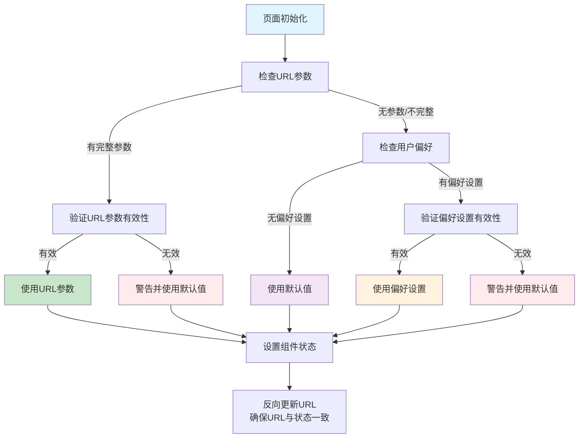

# UI视图优先级逻辑文档

## 概述

本文档描述了应用程序中UI视图的默认打开逻辑，确保在不同场景下正确加载用户界面视图。

## 优先级顺序

系统严格按照以下优先级顺序来确定打开哪个UI视图：

1. **URL参数** （最高优先级）
2. **用户偏好设置** 
3. **默认值** （最低优先级）

## 流程图



## 涉及的页面总览

| 页面 | URL参数 | 有效值 | 默认值 | 说明 |
|------|---------|--------|--------|------|
| PlanHomePage | `?tab=` | `plan`, `sub_activity` | `plan` | 计划管理页面 |
| PlanProgressHomePage | `?category=&viewMode=` | `daily`, `sleep` / `DAILY_TRACK`, `ACCUMULATED_VALUE_TO_TODAY`, `ACCUMULATED_VALUE_TO_PLAN_END_DATE` | `daily` / `DAILY_TRACK` | 计划进度统计页面 |
| ReminderHomePage | `?category=&viewMode=` | `life`, `work`, `study` / `full`, `compact` | `life` / `full` | 提醒管理页面 |

## 涉及的页面

### 1. PlanHomePage.tsx

**URL参数格式：** `?tab=plan|sub_activity`

**测试场景：**

| 场景 | URL参数 | 用户偏好 | 最终结果 | 说明 |
|------|---------|----------|----------|------|
| 1 | `?tab=sub_activity` | 任意 | `sub_activity` | URL优先级最高 |
| 2 | `?tab=invalid` | 任意 | `plan` | 无效URL，使用默认值 |
| 3 | 无 | `sub_activity` | `sub_activity` | 从偏好恢复，并更新URL |
| 4 | 无 | `invalid` | `plan` | 无效偏好，使用默认值 |
| 5 | 无 | 无 | `plan` | 使用默认值 |

**默认值：** `plan`

### 2. PlanProgressHomePage.tsx

**URL参数格式：** `?category=daily|sleep&viewMode=DAILY_TRACK|ACCUMULATED_VALUE_TO_TODAY|ACCUMULATED_VALUE_TO_PLAN_END_DATE`

**测试场景：**

#### Category参数

| 场景 | URL参数 | 用户偏好 | 最终结果 | 说明 |
|------|---------|----------|----------|------|
| 1 | `?category=sleep` | 任意 | `sleep` | URL优先级最高 |
| 2 | `?category=invalid` | 任意 | `daily` | 无效URL，使用默认值 |
| 3 | 无 | `sleep` | `sleep` | 从偏好恢复，并更新URL |
| 4 | 无 | `invalid` | `daily` | 无效偏好，使用默认值 |
| 5 | 无 | 无 | `daily` | 使用默认值 |

#### ViewMode参数

| 场景 | URL参数 | 用户偏好 | 最终结果 | 说明 |
|------|---------|----------|----------|------|
| 1 | `?viewMode=ACCUMULATED_VALUE_TO_TODAY` | 任意 | `ACCUMULATED_VALUE_TO_TODAY` | URL优先级最高 |
| 2 | `?viewMode=invalid` | 任意 | `DAILY_TRACK` | 无效URL，使用默认值 |
| 3 | 无 | `ACCUMULATED_VALUE_TO_TODAY` | `ACCUMULATED_VALUE_TO_TODAY` | 从偏好恢复，并更新URL |
| 4 | 无 | `invalid` | `DAILY_TRACK` | 无效偏好，使用默认值 |
| 5 | 无 | 无 | `DAILY_TRACK` | 使用默认值 |

**默认值：** 
- Category: `daily`
- ViewMode: `DAILY_TRACK`

### 3. ReminderHomePage.tsx

**URL参数格式：** `?category=life|work|study&viewMode=full|compact`

**测试场景：**

#### Category参数

| 场景 | URL参数 | 用户偏好 | 最终结果 | 说明 |
|------|---------|----------|----------|------|
| 1 | `?category=work` | 任意 | `work` | URL优先级最高 |
| 2 | `?category=invalid` | 任意 | `life` | 无效URL，使用默认值 |
| 3 | 无 | `work` | `work` | 从偏好恢复，并更新URL |
| 4 | 无 | `invalid` | `life` | 无效偏好，使用默认值 |
| 5 | 无 | 无 | `life` | 使用默认值 |

#### ViewMode参数

| 场景 | URL参数 | 用户偏好 | 最终结果 | 说明 |
|------|---------|----------|----------|------|
| 1 | `?viewMode=compact` | 任意 | `compact` | URL优先级最高 |
| 2 | `?viewMode=invalid` | 任意 | `full` | 无效URL，使用默认值 |
| 3 | 无 | `compact` | `compact` | 从偏好恢复，并更新URL |
| 4 | 无 | `invalid` | `full` | 无效偏好，使用默认值 |
| 5 | 无 | 无 | `full` | 使用默认值 |

**默认值：** 
- Category: `life`
- ViewMode: `full`

## 关键特性

### 1. 验证机制
- 所有参数都经过严格验证
- 无效值会在控制台显示警告
- 自动降级到默认值

### 2. URL同步
- 组件状态变化时自动更新URL
- 确保浏览器地址栏与UI状态一致
- 支持浏览器前进/后退

### 3. 容错处理
- 处理各种边界情况
- 优雅降级到默认值
- 详细的调试日志

### 4. 性能优化
- 使用 `replace: true` 避免历史记录堆积
- 批量URL更新减少重渲染
- 合理的依赖项管理
- **延迟持久化**：使用100ms延迟避免竞态条件，让数据加载先触发

## 实现细节

### 验证函数

```typescript
// PlanHomePage.tsx
const getValidSelectedTab = (tab: string | undefined | null): 'plan' | 'sub_activity' => {
    const validTabs: ('plan' | 'sub_activity')[] = ['plan', 'sub_activity'];
    const defaultTab: 'plan' | 'sub_activity' = 'plan';
    
    if (tab && typeof tab === 'string' && validTabs.includes(tab as any)) {
        return tab as 'plan' | 'sub_activity';
    }
    
    if (tab && tab !== defaultTab) {
        console.warn(`[PlanHomePage] 无效的tab值: ${tab}, 使用默认值: ${defaultTab}`);
    }
    
    return defaultTab;
};

// PlanProgressHomePage.tsx
const getValidSelectedTab = (tab: string | undefined | null): 'daily' | 'sleep' => {
    const validTabs: ('daily' | 'sleep')[] = ['daily', 'sleep'];
    const defaultTab: 'daily' | 'sleep' = 'daily';
    
    if (tab && typeof tab === 'string' && validTabs.includes(tab as any)) {
        return tab as 'daily' | 'sleep';
    }
    
    if (tab && tab !== defaultTab) {
        console.warn(`[PlanProgressHomePage] 无效的category值: ${tab}, 使用默认值: ${defaultTab}`);
    }
    
    return defaultTab;
};

// ReminderHomePage.tsx
const getValidSelectedTab = (tab: string | undefined | null): 'life' | 'work' | 'study' => {
    const validTabs: ('life' | 'work' | 'study')[] = ['life', 'work', 'study'];
    const defaultTab: 'life' | 'work' | 'study' = 'life';
    
    if (tab && typeof tab === 'string' && validTabs.includes(tab as any)) {
        return tab as 'life' | 'work' | 'study';
    }
    
    if (tab && tab !== defaultTab) {
        console.warn(`[ReminderHomePage] 无效的category值: ${tab}, 使用默认值: ${defaultTab}`);
    }
    
    return defaultTab;
};

const getValidViewMode = (mode: string | undefined | null): 'full' | 'compact' => {
    const validModes: ('full' | 'compact')[] = ['full', 'compact'];
    const defaultMode: 'full' | 'compact' = 'full';
    
    if (mode && typeof mode === 'string' && validModes.includes(mode as any)) {
        return mode as 'full' | 'compact';
    }
    
    if (mode && mode !== defaultMode) {
        console.warn(`[ReminderHomePage] 无效的viewMode值: ${mode}, 使用默认值: ${defaultMode}`);
    }
    
    return defaultMode;
};
```

### 初始化逻辑

```typescript
const [selectedTab, setSelectedTab] = useState(() => {
    // 1. 首先检查URL是否有完整信息
    const urlTab = searchParams.get('tab');
    if (urlTab) {
        const validTab = getValidSelectedTab(urlTab);
        console.log(`从URL加载tab: ${urlTab} -> ${validTab}`);
        return validTab;
    }
    
    // 2. 如果URL没有信息，检查用户偏好
    const persistedTab = pageState?.planHomePage?.selectedTab;
    if (persistedTab) {
        const validTab = getValidSelectedTab(persistedTab);
        console.log(`从用户偏好加载tab: ${persistedTab} -> ${validTab}`);
        return validTab;
    }
    
    // 3. 最后使用默认值
    const defaultTab = 'plan';
    console.log(`使用默认tab: ${defaultTab}`);
    return defaultTab;
});
```

### URL反向更新

```typescript
useEffect(() => {
    const urlTab = searchParams.get('tab');
    
    // 如果URL没有tab参数，或者URL参数与当前状态不一致，则反向更新URL
    if (!urlTab || urlTab !== selectedTab) {
        const newSearchParams = new URLSearchParams(searchParams);
        newSearchParams.set('tab', selectedTab);
        console.log(`反向更新URL: tab=${selectedTab}`);
        setSearchParams(newSearchParams, { replace: true });
    }
}, [selectedTab, searchParams, setSearchParams]);
```

### 延迟持久化优化

为了避免竞态条件和提升性能，所有页面都使用了统一的延迟持久化机制：

```typescript
// utils/hooks/useDebouncedPersist.ts
export const usePageViewPersist = (pageName: string, delay: number = 100) => {
    const { debouncedExecute, cleanup } = useDebouncedPersist(delay);

    const persistPageState = useCallback((
        persistFunction: () => void,
        stateDescription?: string
    ) => {
        const logContext = `${pageName}${stateDescription ? ` - ${stateDescription}` : ''}`;
        debouncedExecute(persistFunction, logContext);
    }, [debouncedExecute, pageName]);

    return { persistPageState, cleanup };
};

// 在组件中使用
const { persistPageState, cleanup } = usePageViewPersist('PlanHomePage');

const handleTabChange = (value: PlanManagementTabType) => {
    setSelectedTab(value);
    
    // 立即更新URL
    const newSearchParams = new URLSearchParams(searchParams);
    newSearchParams.set('tab', value);
    setSearchParams(newSearchParams);
    
    // 延迟持久化状态，让数据加载先触发
    persistPageState(() => {
        setPlanHomePageState({
            selectedTab: value
        });
    }, `tab=${value}`);
};
```

**优势：**
- 避免频繁的状态持久化操作
- 让数据加载优先于状态保存
- 统一的错误处理和日志记录
- 自动清理定时器防止内存泄漏

## 调试指南

### 控制台日志

系统会在控制台输出详细的加载过程：

```
[PlanHomePage] 从URL加载tab: sub_activity -> sub_activity
[PlanHomePage] 反向更新URL: tab=sub_activity
[DebouncedPersist] PlanHomePage - tab=plan - 延迟持久化完成
```

```
[PlanProgressHomePage] 从用户偏好加载category: sleep -> sleep
[PlanProgressHomePage] 使用默认viewMode: DAILY_TRACK
[PlanProgressHomePage] 反向更新URL: category=sleep, viewMode=DAILY_TRACK
[DebouncedPersist] PlanProgressHomePage - category=daily, viewMode=DAILY_TRACK - 延迟持久化完成
```

```
[ReminderHomePage] 从URL加载category: work -> work
[ReminderHomePage] 使用默认viewMode: full
[ReminderHomePage] 反向更新URL: category=work, viewMode=full
[DebouncedPersist] ReminderHomePage - category=life, viewMode=compact - 延迟持久化完成
```

### 常见问题

1. **URL参数不生效**
   - 检查参数名是否正确（tab vs category）
   - 检查参数值是否在有效范围内

2. **偏好设置不保存**
   - 确认 `handleTabChange` 函数调用了持久化方法
   - 检查用户偏好存储是否正常工作

3. **URL不更新**
   - 确认 `useEffect` 依赖项正确
   - 检查 `setSearchParams` 是否被正确调用

## 更新历史

- **2024-01-XX**: 初始版本，建立基本优先级逻辑
- **2024-01-XX**: 增强验证机制，添加容错处理
- **2024-01-XX**: 完善URL同步，优化性能 